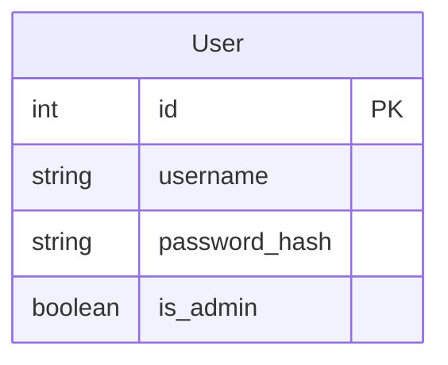
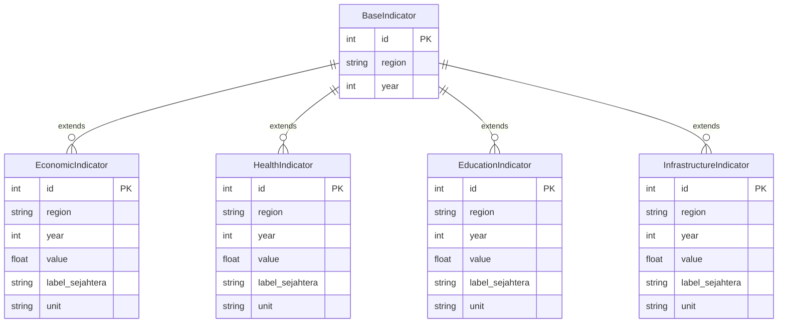
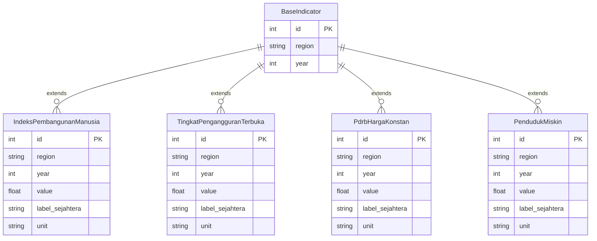
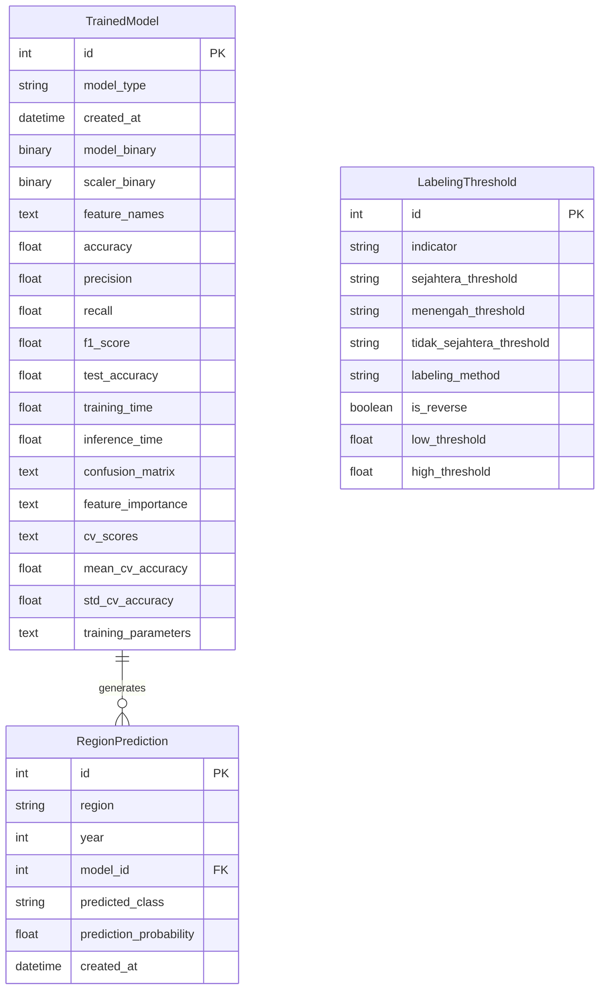
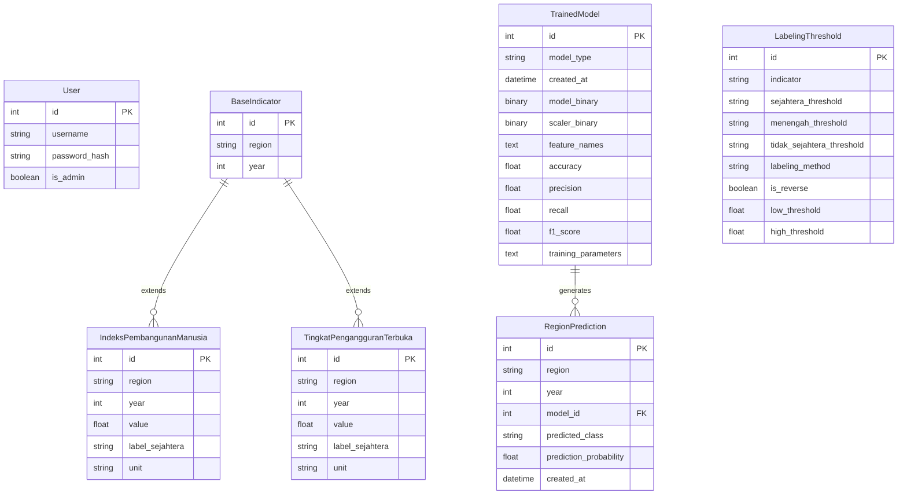

# Database Diagram

## Overview

This document contains database diagrams for the Kesejahteraan project using Mermaid.js.

## User Model

## Indicator Models

## Economic Indicators Detail

## ML Models and Predictions

## Complete Database Schema

