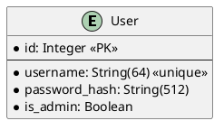
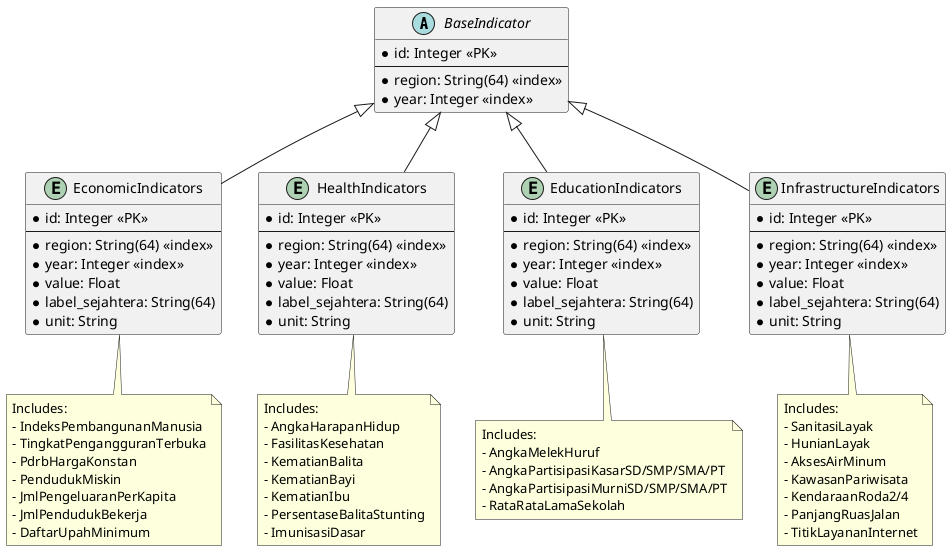
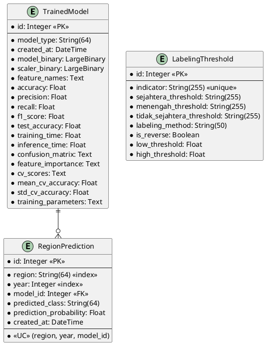
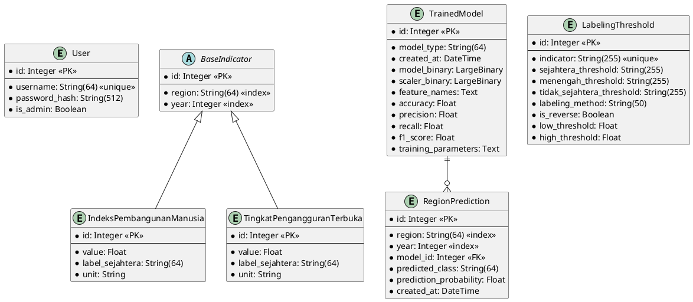

# Database UML Diagrams

## Overview

This document contains UML diagrams for the database tables in the Kesejahteraan project.

## User Model

## Indicator Models

## ML Models and Predictions

## Complete Database Schema

