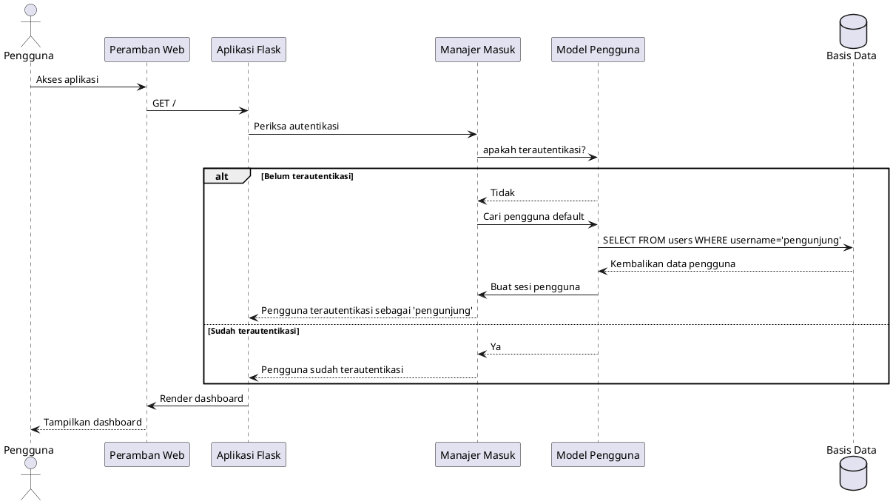
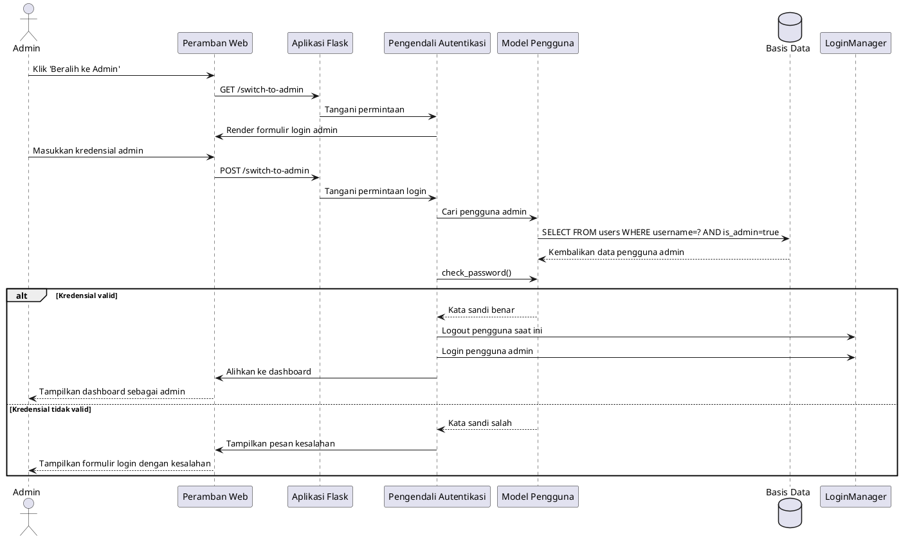
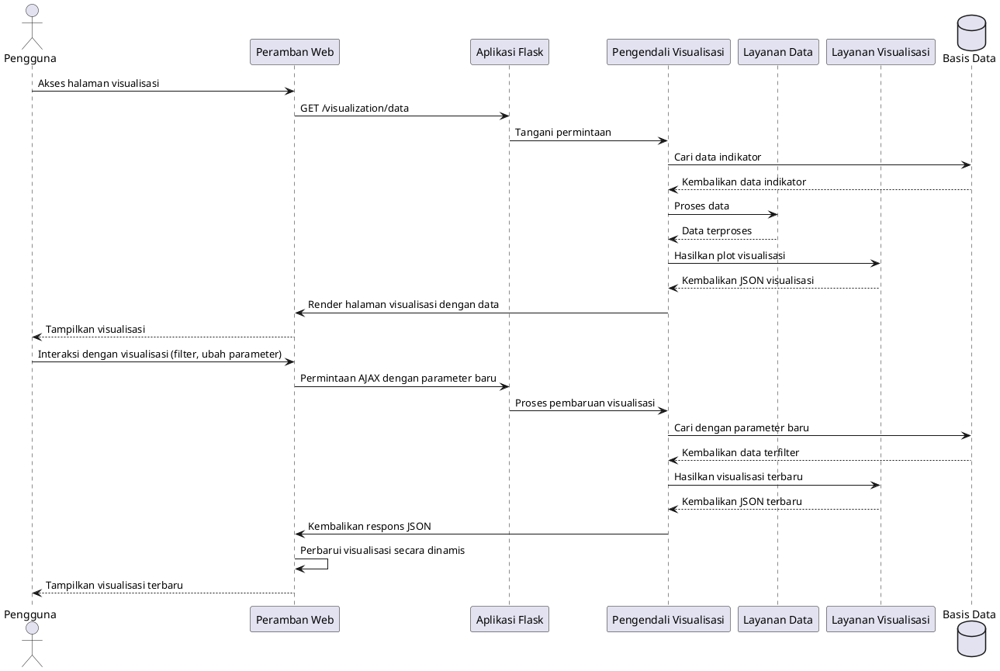
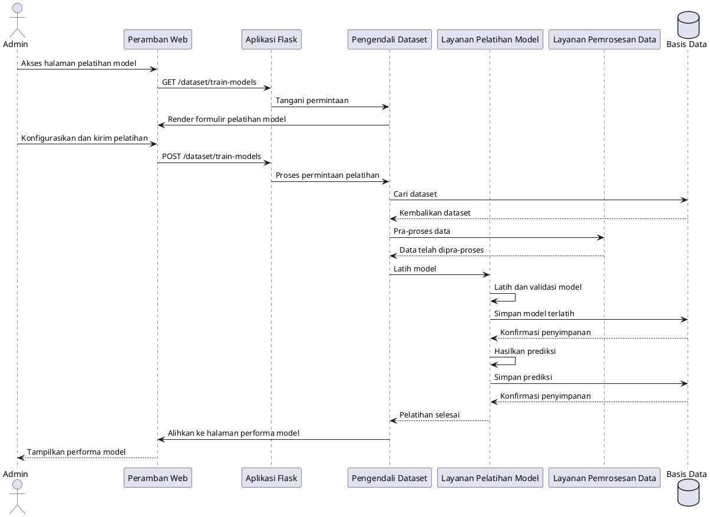
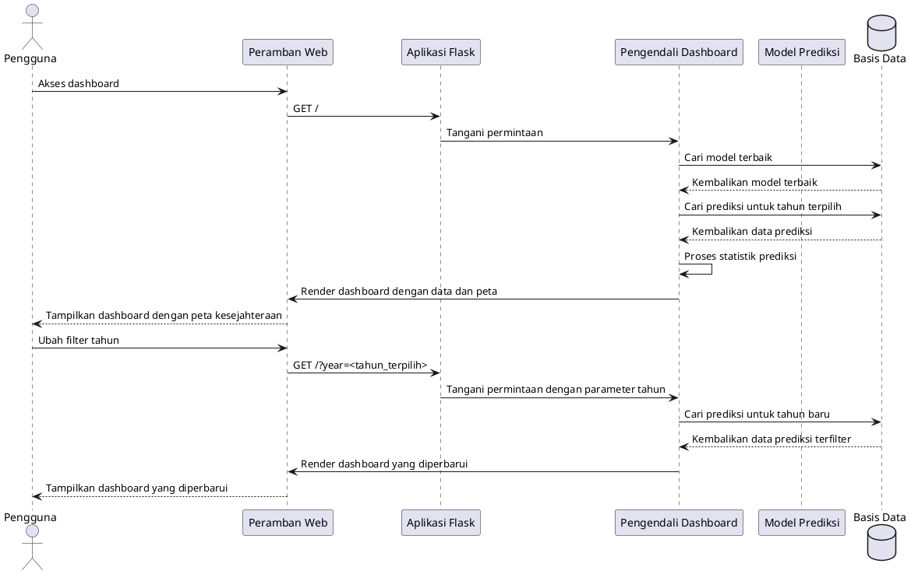
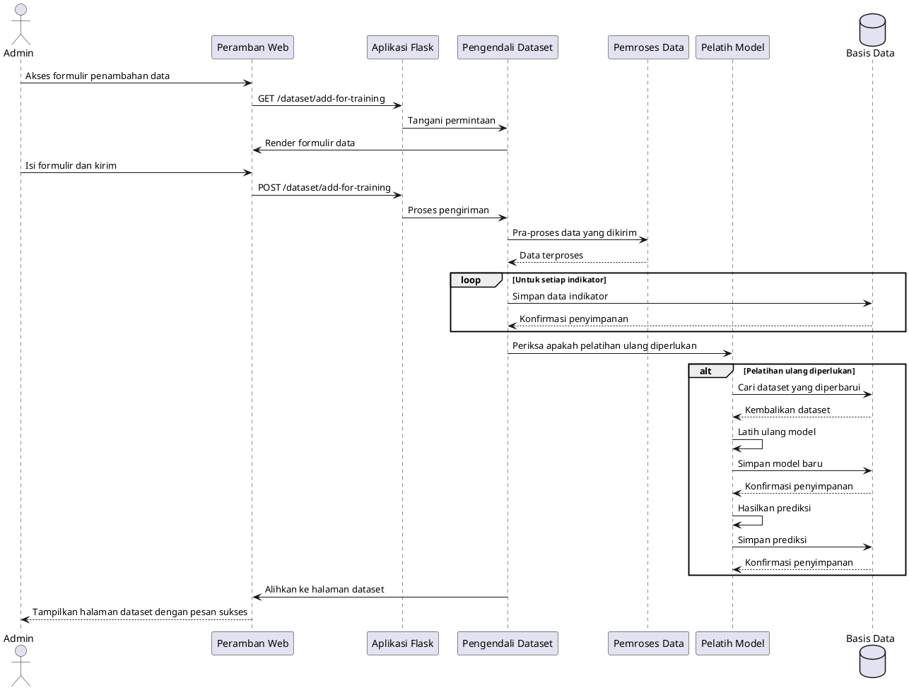
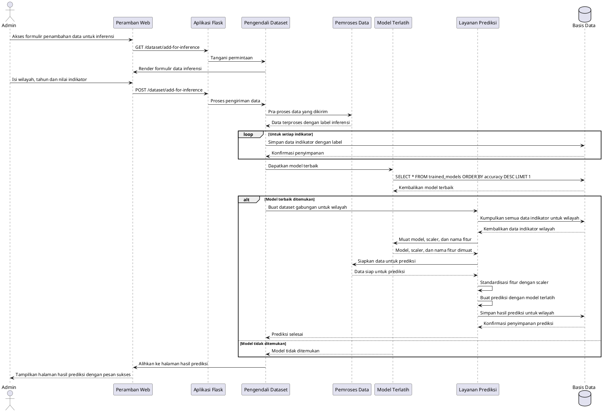

# Kesejahteraan Application Sequence Diagram

## User Authentication Flow

## Admin Login Flow

## Dataset Visualization Flow

## Model Training Flow

## Dashboard Flow

## Data Addition Flow

## Alur Penambahan Data untuk Inferensi

